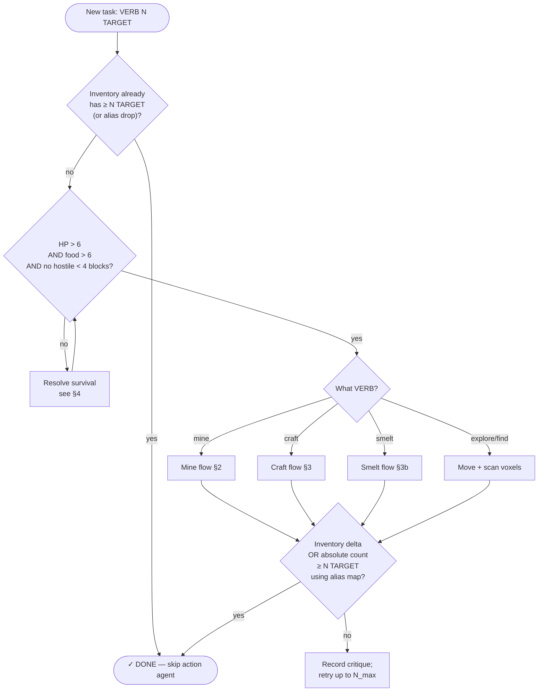
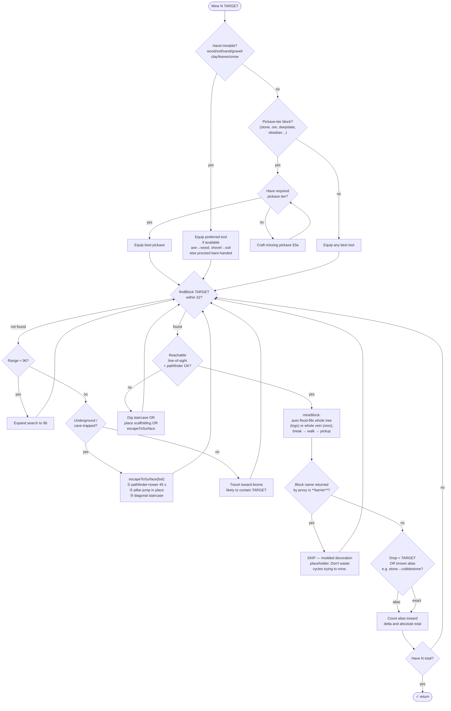
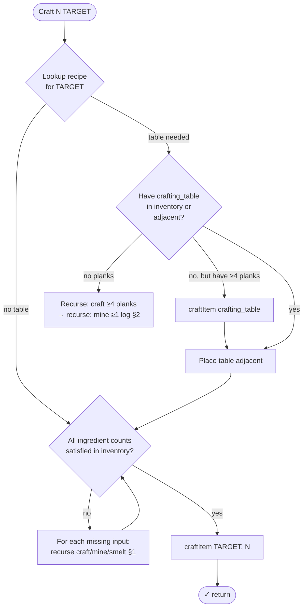
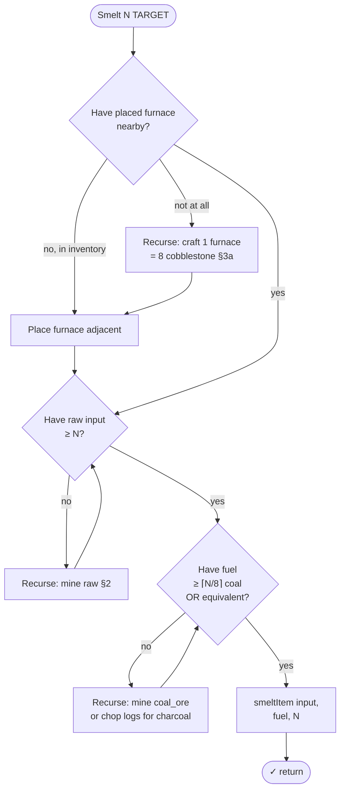
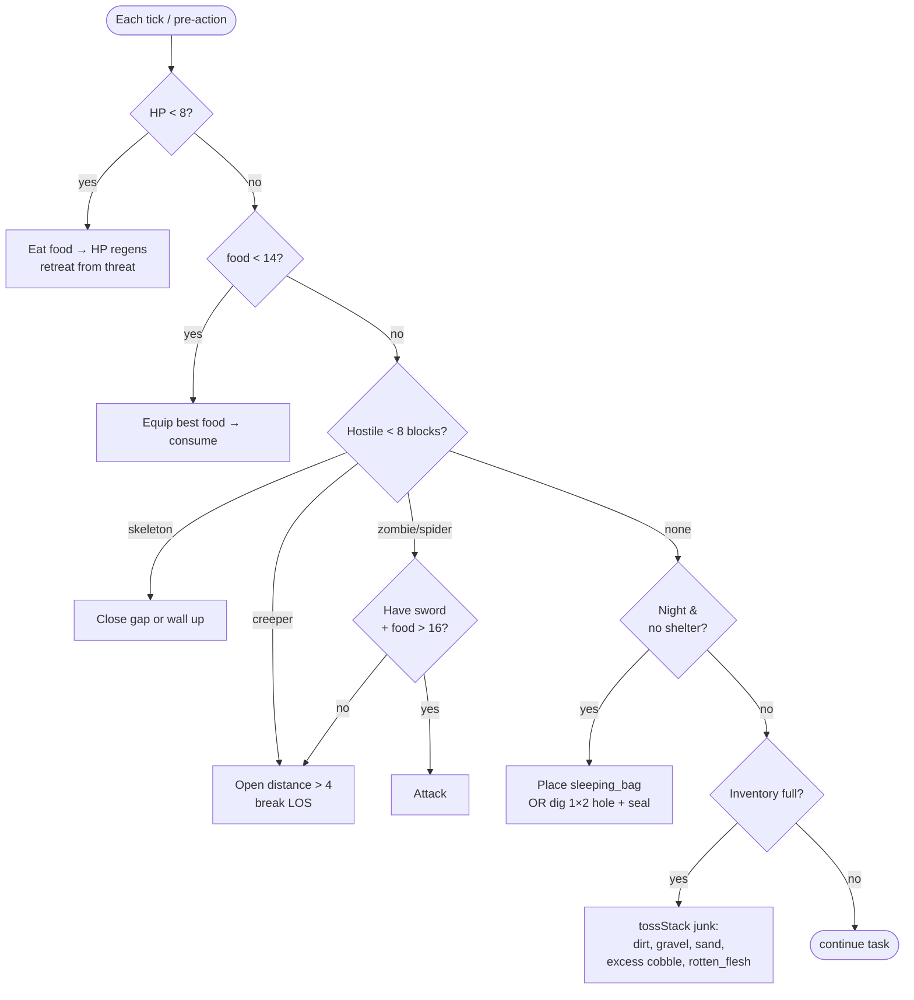
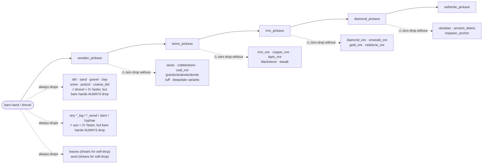
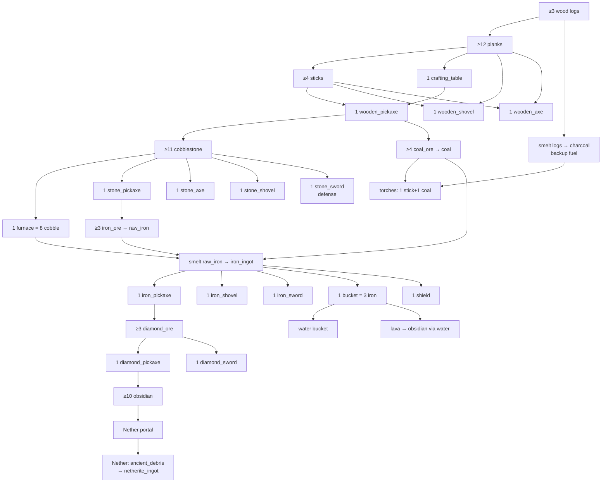

# MineVoyager — Time-Efficient Minecraft Decision Flow

Universal decision tree the agent should follow for **any** modded instance, with notes tailored to our Forge 1.18.2 + bridge-proxy setup.

The core principle: **walk the prerequisite chain BACKWARDS from the target until every leaf is something you already have or can hand-pick, then execute FORWARDS, satisfying each prereq as a step.** Skip steps whose result is already in inventory.

---

## 1. Top-level rollout decision



---

## 2. Mine-flow: backward prerequisite walk



---

## 3a. Craft-flow: recipe walk



## 3b. Smelt-flow



---

## 4. Survival interrupts (always preempt mining)



---

## 5. Tool-tier ladder (mine requirements)



**Drop aliases (counts toward target):**

| Block target | Counts these drops |
|---|---|
| `stone` | `cobblestone`, `stone` (Silk Touch) |
| `coal_ore`, `deepslate_coal_ore` | `coal` |
| `iron_ore`, `deepslate_iron_ore` | `raw_iron` |
| `copper_ore`, `deepslate_copper_ore` | `raw_copper` |
| `gold_ore`, `deepslate_gold_ore` | `raw_gold` |
| `nether_gold_ore` | `gold_nugget` |
| `diamond_ore` | `diamond` |
| `emerald_ore` | `emerald` |
| `lapis_ore` | `lapis_lazuli` |
| `redstone_ore` | `redstone` |
| `nether_quartz_ore` | `quartz` |
| `gravel` | `gravel` or `flint` |
| `grass_block` | `dirt`, `grass_block` |
| `clay` | `clay_ball` |
| `snow`, `snow_block` | `snowball` |
| `glowstone` | `glowstone_dust` |
| `melon` | `melon_slice` |
| `sweet_berry_bush` | `sweet_berries` |
| `cocoa` | `cocoa_beans` |

---

## 6. Strategic progression (Stone Age → Diamond Age)

The curriculum should respect this DAG; never propose a node whose ancestors aren't done.



---

## 7. Modded-instance robustness rules

These are the lessons our bridge-proxy setup taught us — they generalize to any modded server:

1. **Trust the bridge, not block names.** When the proxy returns `barrier`, that's an unmappable modded decoration. Skip it; never plan around it.
2. **Always check drops, not block IDs.** Use the alias table (§5). A successful mine of `stone` will NEVER add `stone` to inventory — only `cobblestone`.
3. **Inventory is the only source of truth.** Don't trust `bot.chat("Done")` from skill code; verify with absolute inventory count.
4. **Preempt before planning.** Before each task, check whether the inventory already satisfies the target. If yes, return success without LLM call.
5. **Distinguish required vs preferred tools.**
   - *Pickaxe-tier blocks* (stone, cobblestone, any `*_ore`, deepslate variants, obsidian, basalt, etc.): bare-hand mining destroys the block with **zero drops**. Always craft the required pickaxe tier first — never attempt bare-handed.
   - *Wood-class blocks* (any `*_log`, `*_wood`, `*_stem`, `*_hyphae`, planks): drops are **guaranteed bare-handed**. An axe only adds speed. **Never abort or demand an axe** just because the bot is empty-handed.
   - *Soil-class blocks* (dirt, sand, gravel, clay, coarse_dirt, podzol, snow, soul_sand, soul_soil): drops are **guaranteed bare-handed**. A shovel only adds speed.
6. **Mine whole trees and whole veins.** `mineBlock` automatically BFS flood-fills connected matching blocks — it will mine the entire tree trunk when targeting any log, and the entire ore vein when targeting an ore block. Request only the minimum you need; the primitive collects any extras automatically.
7. **Escape cave before surface tasks.** If pathfinding to a surface goal fails, call `escapeToSurface(bot)`, which tries three strategies in order: (1) pathfinder with `canDig + allow1by1towers` for 45 s, (2) manual **pillar-jump** — digs ceiling shaft, places scaffold block underfoot while airborne, rises 1 block per step (works in 1×1 crevices), (3) ascending diagonal staircase. Call this before smelting, crafting, or any task that requires reaching a surface structure.
8. **Modded `_ore` blocks may not match vanilla regex.** The proxy substitutes per-ore-type (`*_iron_ore` → `iron_ore`); trust the substitution.
9. **Hunger is a hidden timer.** food=0 ⇒ no sprint, slow regen, eventual HP loss. Always interrupt for food when food < 14.
10. **Curriculum must reject already-done tasks.** Otherwise the LLM loops on "Mine N X" forever when N of X already in inventory.

---

## 8. Pseudocode summary (matches §1)

```
def execute(task):                       # task = "VERB N TARGET"
    if deterministic_check(task, inventory):    # §1 preempt
        return SUCCESS
    while not survival_ok():                    # §4
        handle_survival()
    plan = walk_back(task)                      # §2/§3
    for step in plan:                           # forward execution
        if deterministic_check(step, inventory):
            continue                            # already done
        execute(step)                           # recurse
    if deterministic_check(task, inventory):
        return SUCCESS
    return RETRY
```
